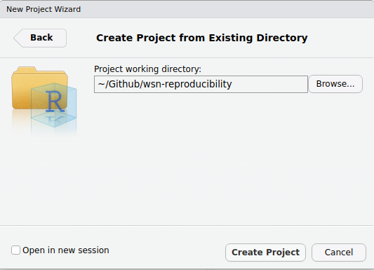

# Reproducibility for *Self*, reproducibility for *All*

The content in this repository is for the workshop on reproducibility in R, given at the Western Society of Naturalists meeting, November 09, 2023. 

## Setting Up Our Working Directory

Start by selecting somewhere on your computer for this directory to live. It usually make sense to keep all your folders for different projects in the same place. So we're all on the same page, we suggest naming it `wsn-reproducibility`. Now, we'll be making some folders to keep our files in. We'll make three folders to start: 

* `/data`
  * `/raw`
  * `/clean`
* `/R`
* `/outputs`

These three are the basis of most analysis projects. Next, we'll make an RProject. To do this, open RStudio, then click *File > New Project > Existing Directory*, then use the *Browse...* button to navigate in your folder structure and select the `wsn-reproducibility` folder. 

We're also going to be making a file in the root of our directory calle `__main.R`. This will be the file that we use to operationalize our "one-click" principle, where we can simply re-run an entire analysis, maybe even with new data, by clicking a single button. 

## Using Data From the Web

In this workshop, we're going to be using two sources of data, one that will be pulled from a NOAA repository and the other that will be pulled from a Google Drive location. To do this, we'll need to write some code in some R files. Start my making a new file in the `/R` folder called `00_data_wrangling.R`. 

In this file will be where we read in the data from the web, and clean it. 

### An Aside on Explicit Package Usage

In this workshop, because of how we're showing you how to set up a working set up, we're going to be using explicit package specification for every single function. This is for two reasons: 

1. We don't want to have to call our packages more than once (this is more efficient), so the package calls will be in the `__main.R` file. 
2. Pedagogically, it makes it more clear which packages are involved. 

Okay, back to data from the web. In our file, start with some basic info at the top of the file including your name, the date, and what this is supposed to be doing in the file (in a few words). In our workflow of writing code, remember we're going to be **continuously updating our4 `__main.R` file with the packages you're using and the files we need**.

For the code we need in this file, refer to the file directly here in the repo. Here are the steps in normal people speak: 

1. Define the URL and download the file
2. Read in the file 
3. Remove the columns we don't need & filter the values 
4. 

INSTRUCTOR NOTES:

1. Note you could just pull the data directly into a dataframe with read_csv() but we aren't doing that here for demonstration purposes and because it gives you a copy in case you want to work offline which for field folks is often 
2. Note we're not doing any cleaning on the species data

